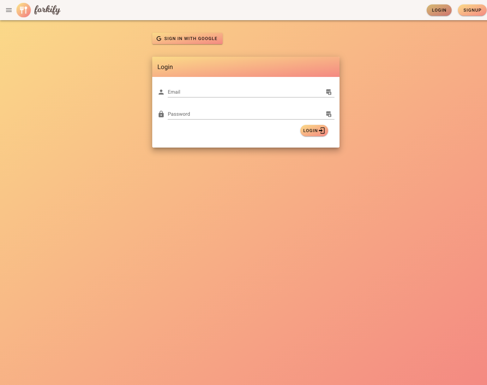
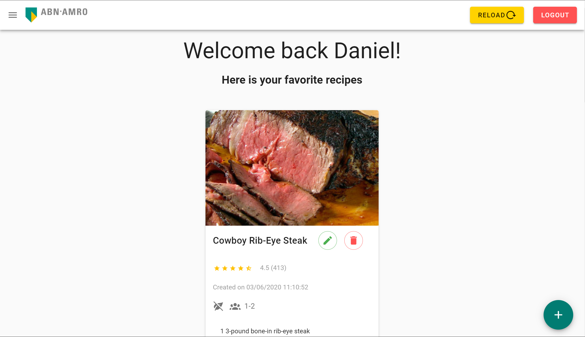
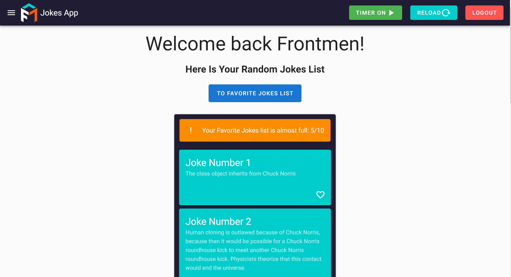
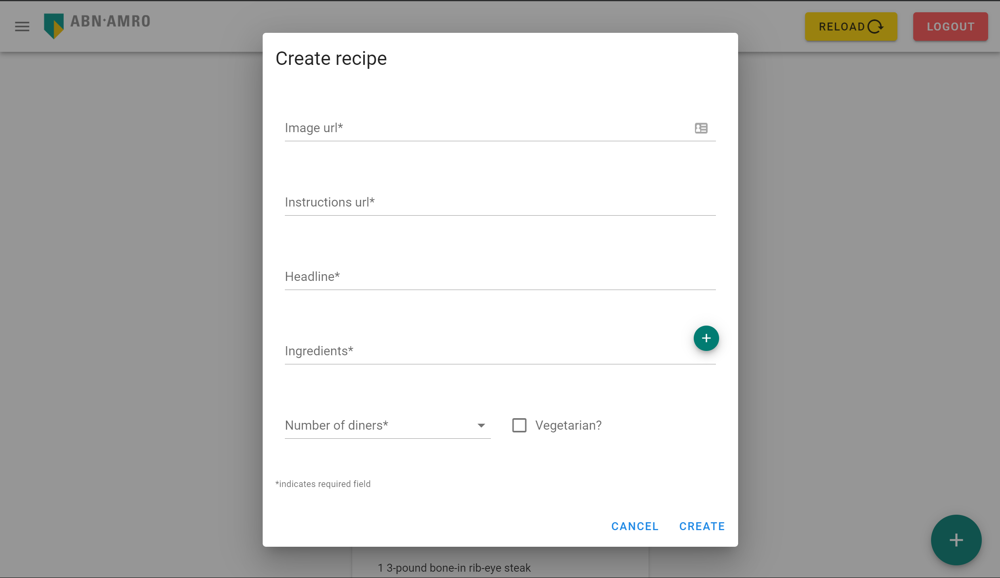
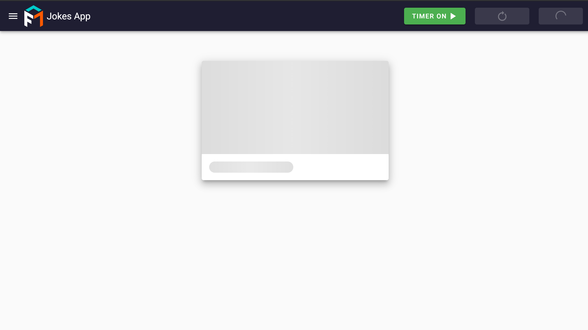

### ABN Recipe

#### Global pre-requisites
- [Node.js](https://nodejs.org/en/) (v12.x or higher, preferably latest LTS)
- [Vue CLI](https://www.npmjs.com/package/@vue/cli) (v4.0.5 or higher)

#### Getting started
1. To run this app you will need to use this boiler plate [https://www.dropbox.com/s/4z004sx0xxui6dg/Applicant-Boilerplate-V1-master.rar?dl=0](https://www.dropbox.com/s/4z004sx0xxui6dg/Applicant-Boilerplate-V1-master.rar?dl=0) and follow the instructions via the README.md file.

2. Navigate to the repository's root directory and run the following commands:
```
npm install
npm run server
npm run serve
```

- The application is now running at [http://localhost:8080](http://localhost:8080)

### Demo images





